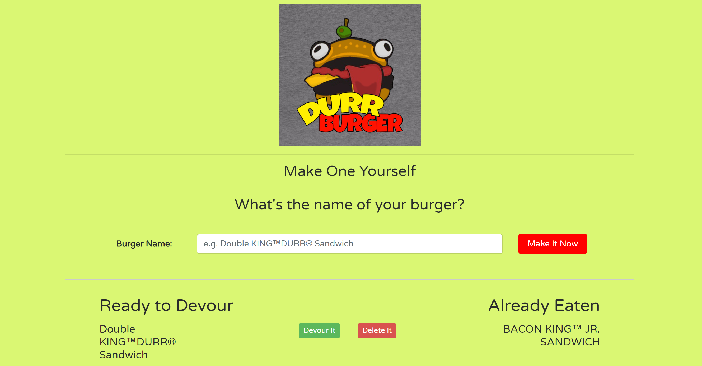

# DurrBurger
http://durrbg.herokuapp.com/

DurrBurger is burger logger with MySQL, Node, Express, Handlebars and a homemade ORM (yum!). It follows the MVC design pattern, uses Node and MySQL to query and route data in the app, and Handlebars to generate your HTML.


* This is a restaurant app that lets users input the names of burgers they'd like to eat.

* Whenever a user submits a burger's name, your app will display the burger on the left side of the page -- waiting to be devoured.

* Each burger in the waiting area also has a `Devour It` button. When the user clicks it, the burger will move to the right side of the page.

* The app will store every burger in a database, whether devoured or not.



[Check It Out](http://durrbg.herokuapp.com/).

## Directory structure

```
.
├── config
│   ├── connection.js
│   └── orm.js
│ 
├── controllers
│   └── burgers_controller.js
│
├── db
│   ├── schema.sql
│   └── seeds.sql
│
├── models
│   └── burger.js
│ 
├── node_modules
│ 
├── package.json
│
├── public
│   └── assets
│       ├── css
│       │   └── burger_style.css
│       └── img
│           └── burger.png
│   
│
├── server.js
│
└── views
    ├── index.handlebars
    └── layouts
        └── main.handlebars
```

## Technologies used

- mysql NPM Package - https://www.npmjs.com/package/mysql
- method override NPM Package - https://www.npmjs.com/package/method-override
- express NPM Package - https://www.npmjs.com/package/express
- express handlebars NPM Package - https://www.npmjs.com/package/express-handlebars
- body parser NPM Package - https://www.npmjs.com/package/body-parser

## Authors

* **Jack Yang** - *HTML/JS/jQuery/Node.js* - [Github](https://github.com/JackJoeng)


